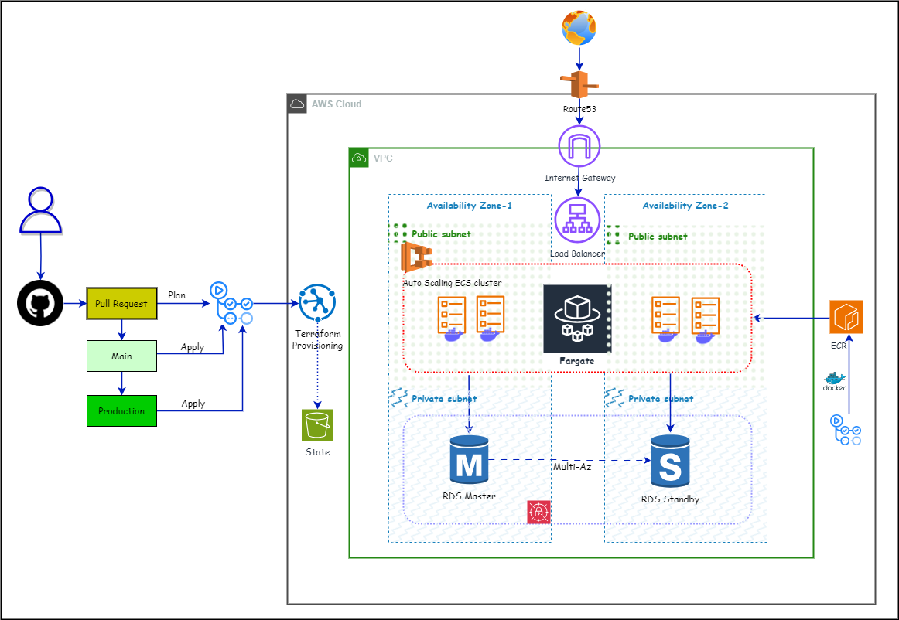

# Terraform AWS infra

## Architecture Design



## Setup

- To download `terraform`, please follow steps mentioned [here](https://spacelift.io/blog/how-to-install-terraform). Make sure you set the environment variable(s).
- Verify if `terraform` has been installed and configure by executing `terraform -v`.
- Install `AWS CLI` from [here](https://docs.aws.amazon.com/cli/latest/userguide/getting-started-install.html).
- Verify if `AWS CLI` has been installed and configued by executing `aws --version`.
- Log in to `AWS Web Console`
  - If user exists, then go to `IAM` -> `Users` -> `<user>` -> `Security Credential` -> `Access keys` -> `Create access key` and note down `Access Key ID` and `Secret Access Key`.
  - If user doesn't exist then create a user with `programmatic access` to AWS and note down `Access Key ID` and `Secret Access Key`.
- Next step is to configure these credentials in the `AWS CLI` by executing `aws configure`. Enter `Access Key ID` and `Secret Access Key`, keep everything else default.

## Usages

- Go to `projects\my-project\staging` directory.
- Execute `terraform init -backend-config="backend.conf"` command to prepare working directory.
- Execute `terraform plan` to show changes which are required to be performed.
- Execute `terraform apply` to create or update infrastructure.
- Please check other below mentioned commands to be executed:

```
Usage: terraform [global options] <subcommand> [args]

The available commands for execution are listed below.
The primary workflow commands are given first, followed by
less common or more advanced commands.

Main commands:
  init          Prepare your working directory for other commands
  validate      Check whether the configuration is valid
  plan          Show changes required by the current configuration
  apply         Create or update infrastructure
  destroy       Destroy previously-created infrastructure

All other commands:
  console       Try Terraform expressions at an interactive command prompt
  fmt           Reformat your configuration in the standard style
  force-unlock  Release a stuck lock on the current workspace
  get           Install or upgrade remote Terraform modules
  graph         Generate a Graphviz graph of the steps in an operation
  import        Associate existing infrastructure with a Terraform resource
  login         Obtain and save credentials for a remote host
  logout        Remove locally-stored credentials for a remote host
  metadata      Metadata related commands
  output        Show output values from your root module
  providers     Show the providers required for this configuration
  refresh       Update the state to match remote systems
  show          Show the current state or a saved plan
  state         Advanced state management
  taint         Mark a resource instance as not fully functional
  untaint       Remove the 'tainted' state from a resource instance
  version       Show the current Terraform version
  workspace     Workspace management

Global options (use these before the subcommand, if any):
  -chdir=DIR    Switch to a different working directory before executing the
                given subcommand.
  -help         Show this help output, or the help for a specified subcommand.
  -version      An alias for the "version" subcommand.
```

## Infracost

- To download `infracost`, please follow the instructions mentioned [here](https://www.infracost.io/docs/).
- Go to `projects\my-project\staging` directory.
- Execute `infracost breakdown --path .` to see the cost.
- Please refer official document for more detailed commands.
